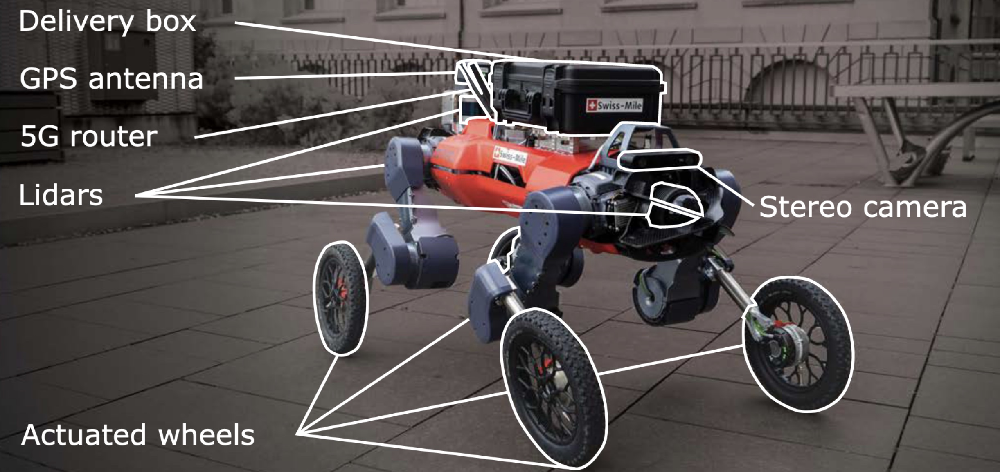
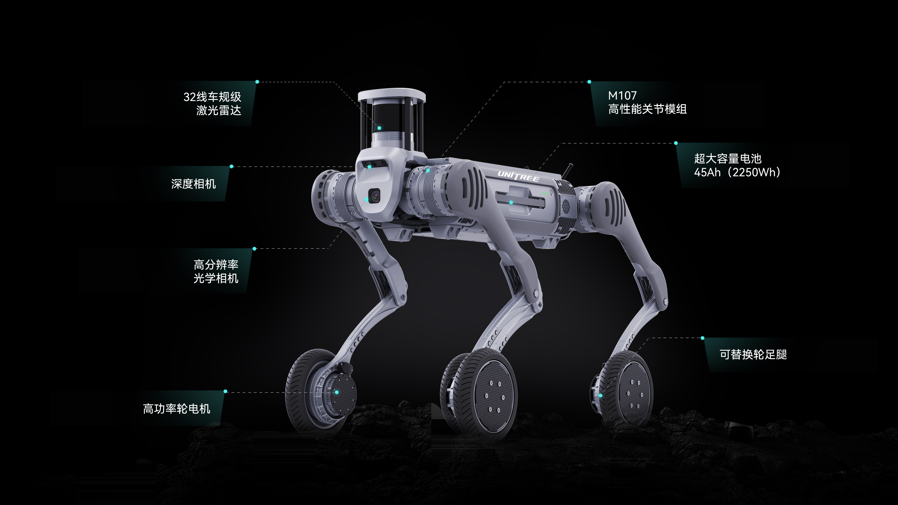
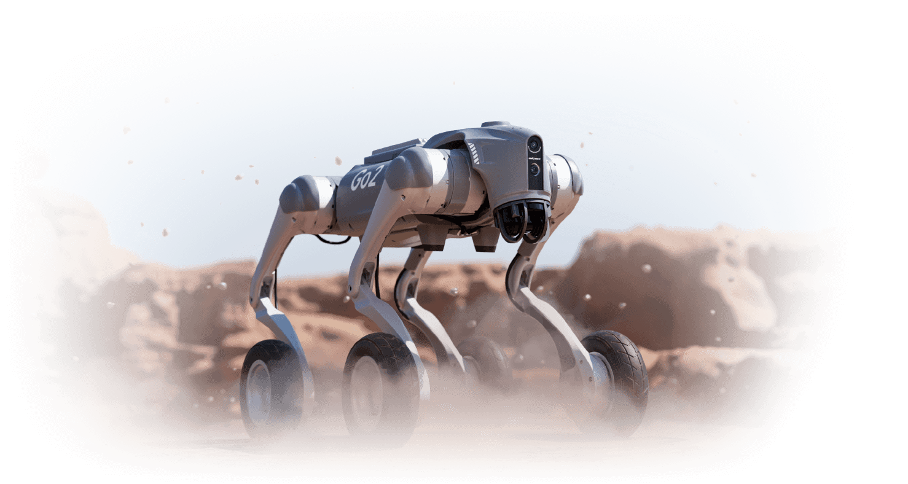
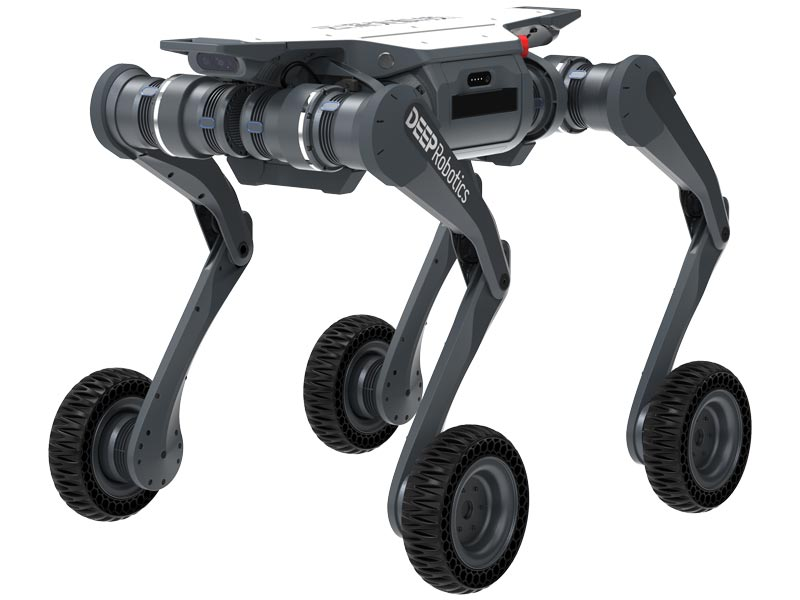
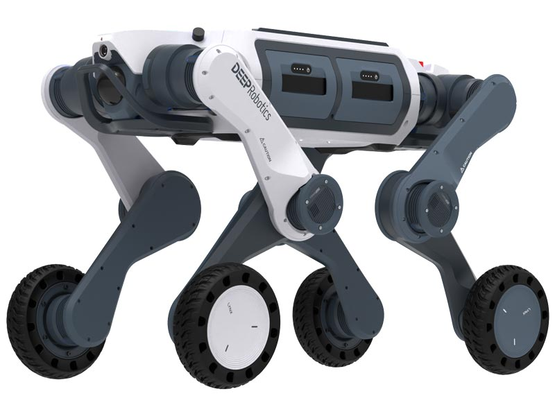
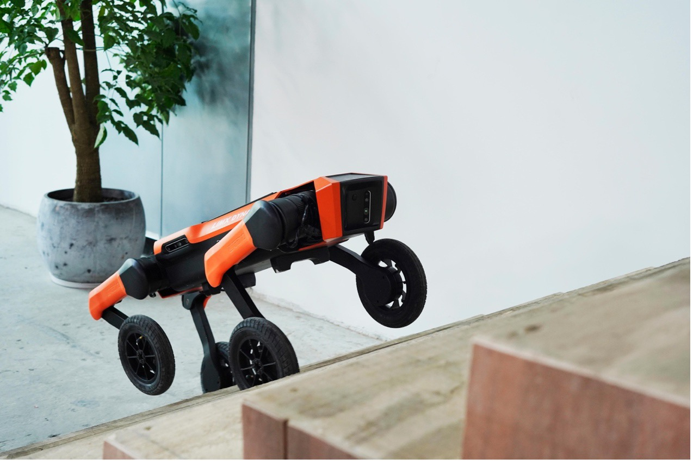

# Awesome Wheel-Legged Robots 

> **A curated list of awesome open-source projects, papers, datasets, simulators, hardware, tutorials, and resources for wheel-legged robots.**

Wheel-legged robots combine the high-speed mobility of wheeled robots and the obstacle-surmounting ability of legged robots. This list aims to collect and organize resources for researchers, engineers, and enthusiasts in this field.

欢迎 PR 贡献中文资料！  
*Inspired by [awesome-robotics](https://github.com/kiloreux/awesome-robotics.git) and [awesome-legged-robots](https://github.com/apexrl/awesome-rl-for-legged-locomotion.git)*

---

## Table of Contents

- [Open Source Projects](#open-source-projects)
- [Research Papers](#research-papers)
- [OverView PPT](#overview-ppt)
- [Hardware Platforms](#hardware-platforms)
- [License](#license)

---

## Open Source Projects 

- [Go2w-RL](https://github.com/ShengqianChen/go2w_rl_gym.git) - A repository that offers a complete simulation environment training and physical deployment for the Unitree Go2w robots.
- [Go2w-dreamwaq-RL](https://github.com/ShengqianChen/DreamWaQ_Go2W.git) - This repo contains my implementation of the paper "Learning Robust Quadrupedal Locomotion With Implicit Terrain Imagination via Deep Reinforcement Learning" on Go2W.
- [Wheel-Legged-Gym](https://github.com/clearlab-sustech/Wheel-Legged-Gym.git) - A repository that offers a RL-based framework for wheel legged robot(two legged).

---

## Research Papers

- **Model-Base**
	- [Keep Rollin’ – Whole-Body Motion Control and  Planning for Wheeled Quadrupedal Robots](model-base/10.pdf) -*2019 RAL*
	-  [Trajectory Optimization for Wheeled-Legged Quadrupedal Robots Using  Linearized ZMP Constraints](model-base/7.pdf) -*2019 RAL*
    - [Trajectory Optimization for Wheeled-Legged  Quadrupedal Robots Driving in Challenging Terrain](model-base/1.pdf) -*2020 RAL*
    - [Rolling in the Deep – Hybrid Locomotion for  Wheeled-Legged Robots using Online Trajectory  Optimization](model-base/8.pdf) -*2020 RAL*
    - [A Computational Framework for Designing Skilled  Legged-Wheeled Robots](model-base/6.pdf) -*2020 RAL*
    - [Whole-Body MPC and Online Gait Sequence Generation for  Wheeled-Legged Robots](model-base/9.pdf) -*2021 IROS*
    - [State Estimation for Hybrid Locomotion of  Driving-Stepping Quadrupeds](model-base/5.pdf) -*2022 IRC*
    - [Balancing Control and Pose Optimization for Wheel-legged Robots Navigating High Obstacles](model-base/3.pdf) -*2022 arxiv*
    - [Compliant Motion Control of Wheel-Legged  Humanoid Robot on Rough Terrains](model-base/2.pdf) -*2024 TRANSACTIONS ON MECHATRONICS*
    - [Nonsmooth Trajectory Optimization for Wheeled  Balancing Robots With Contact Switches and Impacts](model-base/4.pdf) -*2025 TRO*

- **RL**
    - [Advanced Skills through Multiple Adversarial Motion Priors in  Reinforcement Learning](rl/1.pdf) -*2023 ICRA*
    - [Learning Robust Autonomous Navigation and Locomotion for Wheeled-Legged Robots](rl/2.pdf) -*2024 Science Robotics*
    - [Reinforcement Learning for Blind Stair Climbing with Legged and  Wheeled-Legged Robots](rl/3.pdf) -*2024 ICRA*
    - [Scalable Multi-Robot Cooperation for Multi-Goal  Tasks Using Reinforcement Learning](rl/4.pdf) -*2025 RAL*
    
---

## OverView PPT

- [model-base](ppt/model-base.pdf)
- [RL](ppt/rl.pdf)

---
## Hardware Platforms

| Name                              | Picture |              wheel-motor| 
|------------------------------------|:-------:|:-------:|
| **Anymal-Wheel**          |  | 不详
| **Untree B2-W**            |  | 50rad/s & 40N/m |
| **Unitree Go2-W**          |  | 不详
| **DeepRobotic-Lynx**  |  | 不详
| **DeepRobotic-M20**         |  | 不详
| **逐际动力**  |  | 不详

---

## License

---
